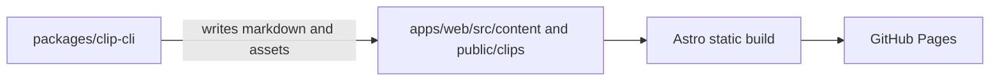

# Architecture

The CLI is local-first. It detects and scrapes an input, validates clip metadata,
then writes content and assets into the web application's repository-backed content
collection. Astro builds that content into a static site. There is no database,
backend, or runtime service.
