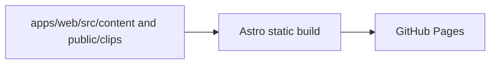

# Architecture

This repository is the clippings site. Markdown clips and assets live in
`apps/web/src/content/clips/` and `apps/web/public/clips/`; Astro builds that
content into a static site that GitHub Actions deploys to Pages. There is no
database, backend, or runtime service.

The `clip` CLI that authoring clips is a separate project published as the
`@iamrajjoshi/cli` npm package ([iamrajjoshi/clip-cli](https://github.com/iamrajjoshi/clip-cli)).
It writes clips into this repository's content collection, either locally or
remotely through the GitHub REST API.
